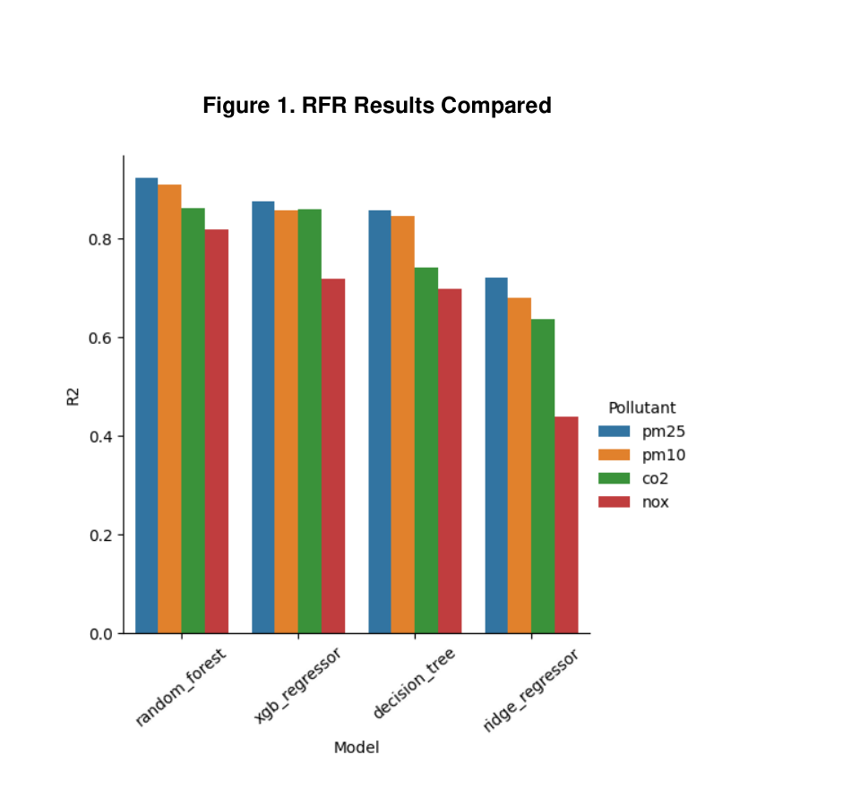
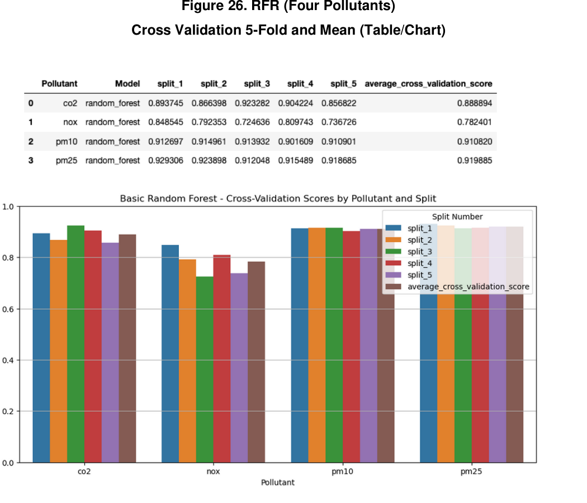
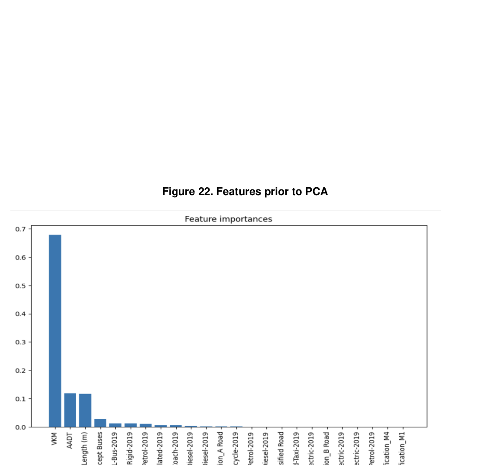

# Machine Learning for London Traffic Emissions Prediction

  

A concise machine learning project exploring how well supervised regression models can predict **road-transport emissions in Greater London** using **LAEI 2019** data.

This work compares multiple regression models for predicting four pollutants:

- **CO2**
- **NOx**
- **PM10**
- **PM2.5**

**Best overall model:** **Random Forest Regression**

## Project snapshot

| Item | Summary |
|---|---|
| Problem | Predict traffic-related atmospheric emissions in Greater London |
| Data | LAEI 2019 major roads traffic and emissions datasets |
| Scale | ~700,000 modeled rows |
| Features | 31 initial features, reduced to 6 principal components after PCA |
| Models compared | Decision Tree, Random Forest, XGBoost, Ridge |
| Best model | Random Forest Regression |

## Key results

| Pollutant | Best model | R² |
|---|---:|---:|
| CO2 | Random Forest | **0.89** |
| NOx | Random Forest | **0.83** |
| PM10 | Random Forest | **0.93** |
| PM2.5 | Random Forest | **0.94** |

Random Forest also performed strongly under **5-fold cross-validation**, with mean scores of **0.889 (CO2)**, **0.782 (NOx)**, **0.911 (PM10)**, and **0.920 (PM2.5)**.

  

## Approach

- cleaned and standardised raw traffic and emissions data
- merged multiple LAEI datasets using **TOID**
- encoded categorical variables with **OneHotEncoder**
- normalised numeric features with **StandardScaler**
- reduced dimensionality using **PCA**
- trained and compared multiple regression models
- tuned Random Forest with **RandomizedSearchCV** and **GridSearchCV**

## Feature insight

Before PCA, **VKM** was the strongest feature, with **AADT** and **link length** also showing importance.

  

## Tech stack

- Python
- Jupyter Notebook
- Pandas
- NumPy
- scikit-learn
- XGBoost
- Matplotlib
- Seaborn

## Files used

### Dataset

The analysis is based on the London Atmospheric Emissions Inventory (LAEI) 2019 published via the London Datastore.

Dataset page:
- [London Datastore – LAEI 2019](https://data.london.gov.uk/dataset/london-atmospheric-emissions-inventory--laei--2019)

Primary source files:
- `laei-2019-major-roads-vkm-flows-speeds.xlsx`
- `LAEI2019-nox-pm-co2-major-roads-link-emissions.xlsx`

## Notes

- this repository contains the notebook-based implementation for the project
- this was completed as part of an MSc Artificial Intelligence module project
- results and visuals in this README are taken from the submitted project report and notebook analysis

## Next improvements

- investigate weaker NOx performance in more depth
- add weather and vehicle-specific features
- package the notebook into a cleaner reproducible pipeline
- add a `requirements.txt` and setup instructions
